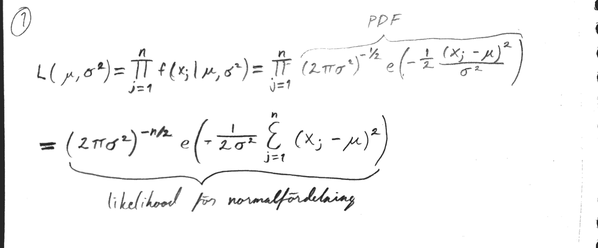
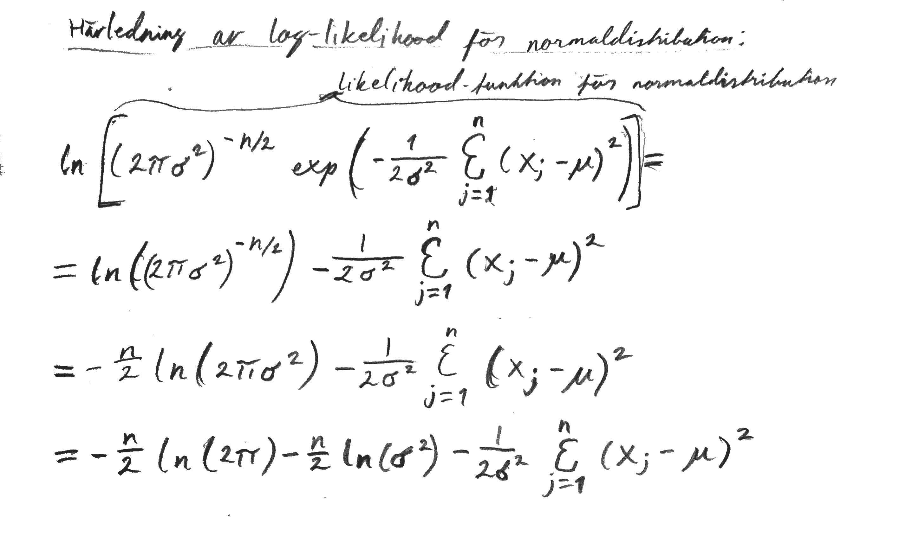
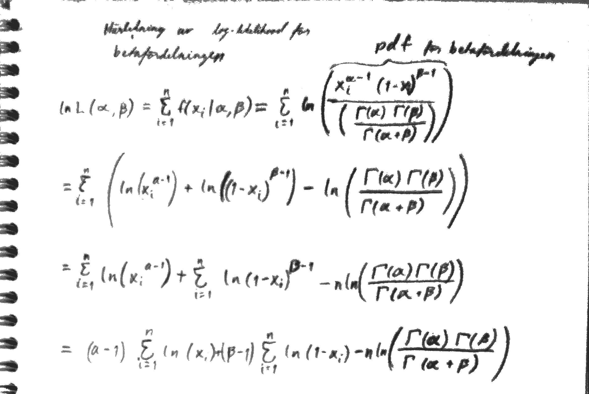

```{r setup, include=FALSE}
knitr::opts_chunk$set(echo = TRUE)
```


# Uppgift 1 Likelihoodfunktioner

```{r, echo = TRUE}
set.seed(4711)
x1 <- rgamma(n = 10, shape = 4, scale = 1)
x2 <- rgamma(n = 100, shape = 4, scale = 1)
```

## a)

```{r, echo = TRUE}
llgamma <- function(x, alpha, beta) {
  return(length(x) * (alpha * log(beta) - lgamma(alpha)) + (alpha -1) * sum(log(x)) - beta * sum(x))
}
```

## b)
```{r, echo = TRUE}
beta_tendraws <- c()
beta_hundreddraws <- c()
steps <- c()

i = 0.01
while(i <= 3) {
  beta_tendraws <- c(beta_tendraws, llgamma(x1, alpha = 4, beta = i))
  beta_hundreddraws <- c(beta_hundreddraws, llgamma(x2, alpha = 4, beta = i))
  steps <- c(steps, i)
  i <- i + 0.01
}
```

```{r, echo = TRUE}
# plot for ten draws
plot(steps, beta_tendraws)
```

```{r, echo = TRUE}
# plot for hundred draws
plot(steps, beta_hundreddraws)
```

```{r, echo = TRUE}
findMax <- function(vect) {
  i <- NULL
  currentMax <- -Inf
  x <- 1
  while (x < length(vect)) {
    if (vect[x] > currentMax) {
      currentMax <- vect[x]
      i <- x
    }
    x <- x + 1
  }
  return(i/100)
}
```

```{r, echo = TRUE}
# Undersöker och returnerar vilket betavärde som loglikelihoodfunktionen får sitt maxvärde på
findMax(beta_tendraws)
findMax(beta_hundreddraws)
```

Det varierar vilket av de upprepade värdena för beta som ger maximala värdet på loglikelihoodfunktionen, men ökar man antalet dragningar går denna siffra mot 1.0.


## c)

```{r, echo = TRUE}

alpha_tendraws <- c()
alpha_hundreddraws <- c()
steps <- c()

i = 0.01
while(i <= 10) {
  alpha_tendraws <- c(alpha_tendraws, llgamma(x1, alpha = i, beta = 1))
  alpha_hundreddraws <- c(alpha_hundreddraws, llgamma(x2, alpha = i, beta = 1))
  steps <- c(steps, i)
  i <- i + 0.01
}

```

```{r, echo = TRUE}
# plot for ten draws
plot(steps, alpha_tendraws)
```

```{r, echo = TRUE}
# plot for hundred draws
plot(steps, alpha_hundreddraws)
```

```{r, echo = TRUE}
# Undersöker och returnerar vilket alphavärde som loglikelihoodfunktionen får sitt maxvärde på

findMax(alpha_tendraws)
findMax(alpha_hundreddraws)
```

Det varierar vilket av de upprepade värdena för alpha som ger maximala värdet på loglikelihoodfunktionen, men ökar man antalet dragningar går denna siffra mot 4.0.


## d) 
### Härledning av log-likelihood för normalfördelning:



```{r, echo = TRUE}
```

```{r, echo = TRUE}
llnormal <- function(x, mu, sigma2) {
  xsum <- sum((x - mu)**2)
  return(-length(x)/2*log(2*pi) - length(x)/2 * log(sigma2) - 1/(2 * sigma2) * xsum)
}

llnormal(x = x1, mu = 2, sigma2 = 1) #Fråga om okej

```


## e) 
```{r, echo = TRUE}
mu_tendraws <- c()
mu_hundreddraws <- c()
steps <- c()

i = 0.01
while(i <= 10) {
  mu_tendraws <- c(mu_tendraws, llnormal(x1, mu = i, sigma2 = 1))
  mu_hundreddraws <- c(mu_hundreddraws, llnormal(x2, mu = i, sigma2 = 1))
  steps <- c(steps, i)
  i <- i + 0.01
}

```

```{r, echo = TRUE}
# plot for ten draws
plot(steps, mu_tendraws)
```

```{r, echo = TRUE}
# plot for hundred draws
plot(steps, mu_hundreddraws)
```

```{r, echo = TRUE}
mu_max_ten <- findMax(mu_tendraws)
alpha_max_ten <- findMax(alpha_tendraws)
beta_max_ten <- findMax(beta_tendraws)
hist(x1, probability = TRUE)
xfit <- seq(0, 10, 0.01)
yfitgamma <- dgamma(xfit, shape = alpha_max_ten, scale = beta_max_ten)
lines(xfit, yfitgamma, col="blue", lwd=2) 
yfitnorm <- dnorm(xfit, mean = mu_max_ten, sd = 1)
lines(xfit, yfitnorm, col="red", lwd = 2)
```

```{r, echo = TRUE}
mu_max_hundred <- findMax(mu_hundreddraws)
alpha_max_hundred <- findMax(alpha_hundreddraws)
beta_max_hundred <- findMax(beta_hundreddraws)
hist(x2, probability = TRUE)
xfit <- seq(0, 10, 0.01)
yfitgamma <- dgamma(xfit, shape = alpha_max_hundred, scale = beta_max_hundred)
lines(xfit, yfitgamma, col="blue", lwd=2) 
yfitnorm <- dnorm(xfit, mean = mu_max_hundred, sd = 1)
lines(xfit, yfitnorm, col="red", lwd = 2)
```

Gammafördelningen tycks passa datamaterialet bäst.


# Uppgift 2 Punktskattning med MLE i en gammafördelning
```{r, echo = TRUE}
gamma_beta_mle <- function(x, alpha) {
  return(length(x)*alpha*1/sum(x))
}
gamma_beta_mle(x1, 4)
gamma_beta_mle(x2, 4)
```
Vi testade att öka antalet dragningar och drar slutsatsen att estimatet går mot 1.0.


# Uppgift 3 Punktskattning med MLE i en normalfördelning
## a)
```{r, echo = TRUE}
norm_mu_mle <- function(x) {
  return(sum(x)/length(x))
}


norm_sigma2_mle <- function(x) {
  mean_x <- norm_mu_mle(x)
  sumhelp <- sum((x - mean_x)**2)
  return(sumhelp/length(x))
}
```

```{r, echo = TRUE}
test_x <- 1:10

norm_mu_mle(x = test_x)

norm_sigma2_mle(x = test_x)

```


## b)
```{r, echo = TRUE}
set.seed(42)
# Skattning med n = 10
y1 <- rnorm(n = 10, mean = 10, sd = 2)

norm_mu_mle(x = y1)


norm_sigma2_mle(x = y1)

# Skattning med n = 10000
y2 <- rnorm(n = 10000, mean = 10, sd = 2)

norm_mu_mle(x = y2)

norm_sigma2_mle(x = y2)
```
Desto större antal dragningar som görs, desto närmare kommer vi mu och sigma2, med respektive norm_mu_mle och norm_sigma2_mle. Detta följer av centralagärnsvärdessatsen som ger oss ett y som går mot normalfördelning och därmed tydligare väntevärde samt varians.


# Uppgift 4 Samplingfördelningen för Bmle, MUmle och sigma2mle
## a)
```{r, echo = TRUE}

beta1_mle <- c(1:2000)
beta2_mle <- c(1:2000)
mu1 <- c(1:2000)
mu2 <- c(1:2000)
sigma1 <- c(1:2000)
sigma2 <- c(1:2000)

i <- 1
while (i <= 2000) {
  x1 <- rgamma(n = 10, shape = 4, rate = 1)
  x2 <- rgamma(n = 10000, shape = 4, rate = 1)
  beta1_mle[i] <- gamma_beta_mle(x = x1, alpha = 4)
  beta2_mle[i] <- gamma_beta_mle(x = x2, alpha = 4)
  
  y1 <- rnorm(n = 10, mean = 10, sd = 2)
  y2 <- rnorm(n = 10000, mean = 10, sd = 2)
  mu1[i] <- norm_mu_mle(x = y1)
  mu2[i] <- norm_mu_mle(x = y2)
  sigma1[i] <- norm_sigma2_mle(x = y1)
  sigma2[i] <- norm_sigma2_mle(x = y2) 
  i <- i + 1
}

```

```{r, echo = TRUE}
hist(beta1_mle)
```

```{r, echo = TRUE}
hist(beta2_mle)
```

```{r, echo = TRUE}
hist(mu1)
```

```{r, echo = TRUE}
hist(mu2)
```

```{r, echo = TRUE}
hist(sigma1)
```

```{r, echo = TRUE}
hist(sigma2)
```
Precis som tidigare ser vi att ju fler dragningar så närmar sig histogrammen en normalfördelning vilket följer av den centrala gränsvärdessatsen.


# Uppgift 5 Log-likelihoodfunktionen för betafördelning
## a) 



```{r, echo = TRUE}
llbeta <- function(par, x){
  sum1 <- (par[1]-1)*sum(log(x))
  sum2 <- (par[2]-1)*sum(log(1-x))
  sum3 <- length(x)*log(gamma(par[1])*gamma(par[2])/gamma(par[1] + par[2]))
  return((sum1 + sum2 - sum3)*-1) # <- Varför multiplicera med -1??
}
llbeta(par = c(2, 2), x = c(0.01, 0.5, 0.99))
```

## b)
```{r, echo = TRUE}
x3 <- rbeta(100, 0.2, 2)
hist(x3)
```

## c)
```{r, echo = TRUE}
opt_res <- optim(par= c(0.2, 2), fn = llbeta, x=x3, upper=Inf,method ="L-BFGS-B", lower = .Machine$double.eps)
opt_res$par
```

## d)
```{r, echo = TRUE}
alpha_mle <- c(1:2000)
beta_mle <- c(1:2000)
i <- 1
while(i <= 2000) {
  x3 <- rbeta(100, 0.2, 2)
  opt_res <- optim(par= c(0.2, 2), fn = llbeta, x=x3, upper=Inf,method ="L-BFGS-B", lower = .Machine$double.eps)
  alpha_mle[i] <- opt_res$par[1]
  beta_mle[i] <- opt_res$par[2]
  i <- i + 1
}
```

```{r, echo = TRUE}
hist(alpha_mle)
```

```{r, echo = TRUE}
hist(beta_mle)
```


