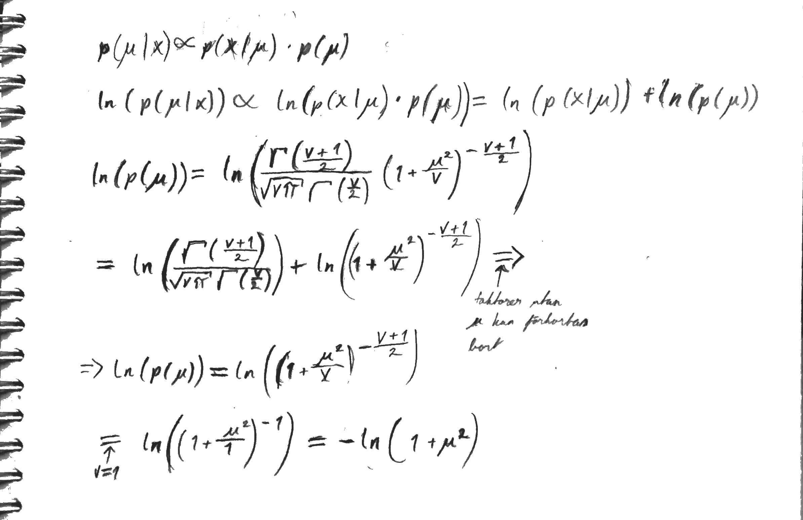
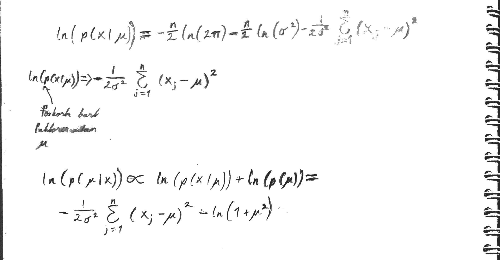

```{r setup, include=FALSE}

library(gtools)
knitr::opts_chunk$set(echo = TRUE)
```

# Uppgift 1 Visualisera posteriorn

## a)
```{r, echo = TRUE}

#prior for Mu
xfit <- seq(-5, 15, 0.01)
priorMu <- dt(xfit, df = 1)
plot(xfit, priorMu, type = 'l', lwd = 3, col = "blue")
```

## b)
```{r, echo = TRUE}

data <- c(11.3710, 9.4353, 10.3631, 10.6329, 10.4043, 9.8939, 11.5115)
hist(xlim = range(-5, 15), x = data)

```

## c)
```{r, echo = TRUE}
normal_log_likelihood <- function(mu, data, sigma2 = 1) {
  xsum <- sum((data - mu)**2)
  return(-length(data)/2*log(2*pi) - length(data)/2 * log(sigma2) - 1/(2 * sigma2) * xsum)
}

xfit <- seq(-5, 15, 0.01)
i <- 1
yfit <- c(xfit)
while(i <= length(xfit)) {
 yfit[i] <- normal_log_likelihood(xfit[i], data)
 i <- i + 1
}

likelihoodplot <- plot(xfit, exp(yfit), type = 'l', lwd = 3, col = "blue")
```

## d) 
### Härledning av posterior för mu:




## e)
```{r, echo = TRUE}
#posterior
xfit <- seq(-5, 15, 0.01)
posterior <- yfit + log(priorMu)
plot(xfit, exp(posterior), type = 'l', lwd = 3, col = "red")

```


# Uppgift 2 Produkt A eller B?

## a)
Alpha = antal personer vi tror kommer gilla vår produkt 
Beta = antal personer vi tror kommer ogilla vår produkt 

Vi väljer dessa parametrar eftersom betafördelningen är en fördelning av sannolikheter. Desto mer data man har desto säkrare kan man vara på inom vilket intervall som produkten sannolikt är omtyckt på. Eftersom den eftersökta sannolikheten är på antal gillningar sätter vi alpha som detta med hänsyn till hur betafördelningen beräknar medelvärdet (mean = alpha / (alpha + beta)).

## b)
```{r, echo = TRUE}
# Prior för produkt A
x <- seq(0, 1, 0.001)
A_beta <- dbeta(x, 7, 3)
plot(x, A_beta, type = 'l', lwd = 3, col = "green")
```

```{r, echo = TRUE}
# Prior för produkt B
x <- seq(0, 1, 0.001)
B_beta <- dbeta(x, 2, 8)
plot(x, B_beta, type = 'l', lwd = 3, col = "red")
```

## c)
### Posterior för produkt A:
A = Beta(7 + 8, 3 + 5) = Beta(15, 8)

E[A] = 15/(15+8) = 15/23

### Posterior för produkt B:
B = Beta(2 + 1, 8 + 2) = Beta(3, 10)

E[B] = 3/(3+10) = 3/13

### Vilken produkt har den högsta förväntade proportionen intresserade?

Svar: Produkt A eftersom 15/23 > 3>13


## d)
### MAP-skattning för produkt A (m h a "mode"):
(15-1)/(15+8-2) = 14/21 = 2/3

### MAP-skattning för produkt B (m h a "mode"):
(3-1)/(3+10-2) = 2/11


## e1)

```{r, echo = TRUE}
x <- seq(0, 1, 0.001)
post_A <- rbeta(x, 15, 8)
hist(xlim = range(0, 1), post_A)
```

```{r, echo = TRUE}
x <- seq(0, 1, 0.001)
post_B <- rbeta(x, 3, 10)
hist(xlim = range(0, 1), post_B)
```

## 1) Vad är sannolikheten att proportionen intresserade kunder är större för produkt A än produkt B?
```{r, echo = TRUE}
AMoreInteresting <- function(a, b) {
  i <- 1
  aLarger <- 0
  while (i < length(a)) {
    if (a[i] > b[i]) {
      aLarger <- aLarger + 1
    }
    i <- i + 1
  }
  return (aLarger/length(a))
}

AMoreInteresting(post_A, post_B)
```

## 2) Vad är sannolikheten att P(p > 0.5) för respektive produkt
```{r, echo = TRUE}
XMoreThanHalfInteresting <- function(x) {
  i <- 1
  xLarger <- 0
  while (i < length(x)) {
    if (x[i] > 0.5) {
      xLarger <- xLarger + 1
    }
    i <- i + 1
  }
  return (xLarger/length(x))
}

XMoreThanHalfInteresting(post_A)
XMoreThanHalfInteresting(post_B)
```


## e2)

```{r, echo = TRUE}
# aposterior för produkt A
x <- seq(0, 1, 0.001)
A_beta <- rbeta(x, 15, 8)
A_rbin <- rbinom(10000, 87, mean(A_beta))
hist(A_rbin)
```

```{r, echo = TRUE}
# aposterior för produkt B
x <- seq(0, 1, 0.001)
B_beta <- rbeta(x, 3, 10)
B_rbin <- rbinom(10000, 87, mean(B_beta))
hist(B_rbin)

```

### 1) Hur stor är sannolikheten att ni får fler än 40 intresserade kunder med respektive produkt?
```{r, echo = TRUE}
# Produkt A:
 length(A_rbin[A_rbin>40])/length(A_rbin)

# Produkt B:
 length(B_rbin[B_rbin>40])/length(B_rbin)
```

### 2) Beräkna väntevärdet på respektive produkt
```{r, echo = TRUE}
# Produkt A:
87 * mean(A_beta)

#Produkt B:
87 * mean(B_beta)
```


# Uppgift 3 Aktieanalys

## a) Ange en prior
```{r, echo = TRUE}
mean <- 0.07/365 # 7 procent genomsnittlig avkastning per år
variance = 0.001**2 # daglig varians på avkastningen (osäkerhet)
xfit <- seq(-0.007, 0.007, 0.0001)
prior <- dnorm(xfit, mean, variance**(1/2))
plot(xfit, prior, type = "l")
```

## b) räkna ut E[my|data],
```{r, echo = TRUE}
data = c(0.0315, -0.0180, -0.0021, -0.0202, 0.0076)
mean_data <- mean(data)
sigma2 <- sum((data-mean_data)**2)/(length(data) - 1) # variance

omega <- (length(data)/sigma2)/(length(data)/sigma2+1/variance)
myx <- omega*mean(data)+(1-omega)*mean # väntevärde för aposterior
print(myx)
thau2x <- 1/(length(data)/sigma2 + 1/variance)
aposterior <- dnorm(xfit, myx, thau2x**(1/2))
plot(xfit, aposterior, type = "l")
```

## c) Beräkna och visualisera Value-at-Risk
```{r, echo = TRUE}
post_sim <- rnorm(10000, myx, thau2x**(1/2))
post_sim <- sort(post_sim, decreasing = FALSE)
post_sim_1perc <- post_sim[1:100]
var <- abs(100000 * post_sim_1perc)

hist(var)
```

## d) Beräkna ett 95% sannolikhetsintervall för Value-at-Risk.

```{r, echo = TRUE}
quantile(var, probs = c(0.0, 0.95))
```
## e)

Dessa antaganden är inte helt rimliga då avkastningar inte är oberoende över tid. Företaget kan under perioder till exempel ha utannonseringar vilket ökar hajpen för aktien och därmed stiger priset och därmed också avkstningen. Att företagets avkastningar är normalfördelade känns rimligt såvida företaget är etablerat och stabilt så dessa borde inte variera alltför mycket över tid. I vårt exempel kollar vi dessutom endast på data över fem dagar vilket är ett väldigt litet stickprov.


# Uppgift 4 Analys av opinionsundersökningar

## a) 
```{r, echo = TRUE}
set.seed(4711)
voteprior <- rdirichlet(n = 1000, alpha = c(20, 8, 10, 4, 30, 7, 6, 13, 2))

#Moderaterna
hist(voteprior[,1], main = "Moderaterna", xlim= c(0, 0.5))
abline(v = 0.2333, col = "blue")

#Folkpartiet
hist(voteprior[,2], main = "Folkpartiet", xlim= c(0, 0.5))
abline(v = 0.0542, col = "blue")

#Centerpartiet
hist(voteprior[,3], main = "Centerpartiet", xlim= c(0, 0.5))
abline(v = 0.0611, col = "green")

#Kristdemokratera
hist(voteprior[,4], main = "Kristdemokraterna", xlim= c(0, 0.5))
abline(v = 0.0457, col = "blue")

#Socialdemokraterna
hist(voteprior[,5], main = "Socialdemokraterna", xlim= c(0, 0.5))
abline(v = 0.3101, col = "red")

#Vänsterpartiet
hist(voteprior[,6], main = "Vänsterpartiet", xlim= c(0, 0.5))
abline(v = 0.0572, col = "red")

#Miljöpartiet
hist(voteprior[,7], main = "Miljöpartiet", xlim= c(0, 0.5))
abline(v = 0.0689, col = "green")

#Sverigedemokraterna
hist(voteprior[,8], main = "Sverigedemokraterna", xlim= c(0, 0.5))
abline(v = 0.1286, col = "blue")

#Feministiskt initiativ
hist(voteprior[,9], main = "Feministiskt initiativ", xlim= c(0, 0.5))
abline(v = 0.0312, col = "pink")
```

## b)

2017-jun 	Sifo 	M: 15.9 	L: 6.2 	C: 13.4 	KD: 2.9 	S: 29.2 	V: 7.7 	MP: 4.0 	SD: 18.0 	FI: 2.1

Anta n = 200.

Antal röster per parti:

  ("=" är i följande fall "ungefär lika med".)
  
  M: n * 0.159 = 32
  
  L: n * 0.062 = 12
  
  C: n * 0.134 = 27
  
  KD: n * 0.029 = 6
  
  S: n * 0.292 = 58
  
  V: n * 0.077 = 15
  
  MP: n * 0.040 = 8
  
  SD: n * 0.180 = 36
  
  FI: n * 0.021 = 4

## c)

```{r, echo = TRUE}
votepost <- rdirichlet(n = 10000, alpha = c(20+32, 8+12, 10+27, 4+6, 30+58, 7+15, 6+8, 13+36, 2+4))

i = 1
while(i <= 10000) {
  j = 1
  while(j <= 9) {
    if (votepost[i,j] < 0.04) {
      votepost[i,j] <- 0
    }
    j <- j + 1
  }
  c <- 1/sum(votepost[i,])
  k = 1
  while (k <= 9) {
    votepost[i,k] <- votepost[i,k] * c
    k <- k + 1
  }
  i <- i + 1
} 
```

### 1. Sannolikheten att rödgröna är större än alliansen.
```{r, echo = TRUE}
sum(votepost[,1]+votepost[,2]+votepost[,3]+votepost[,4]<votepost[,5]+votepost[,6]+votepost[,7])/10000
```

### 2. Sannolikheten att SD är större än M.
```{r, echo = TRUE}
sum(votepost[votepost[,8] > votepost[,1]])/10000
```

### 3. Sannolikheten att KD inte kommer in i riksdagen.
```{r, echo = TRUE}
sum(votepost[,4] < 0.04)/10000
```

### 4. Sannolikheten att MP inte kommer in i riksdagen.
```{r, echo = TRUE}
sum(votepost[,7] < 0.04)/10000
```

### 5. Sannolikhetsintervall (95%) för S.
```{r, echo = TRUE}
quantile(votepost[,5], probs = c(0.025, 0.975))
```


